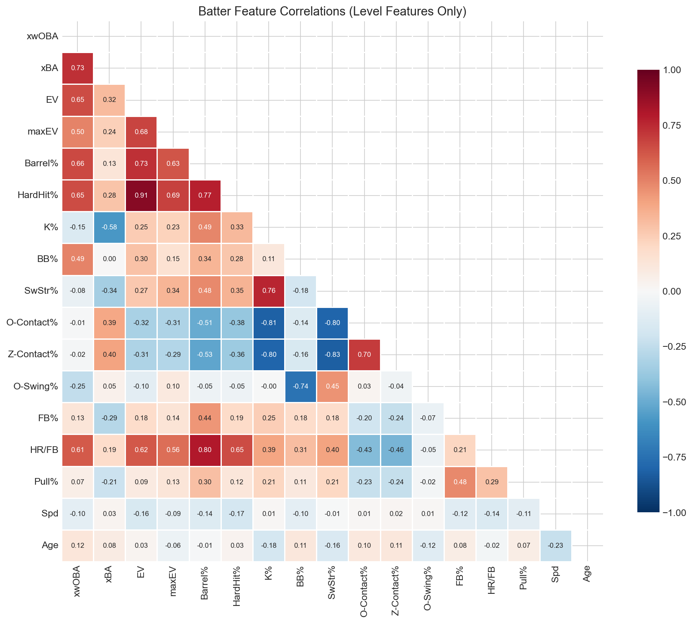
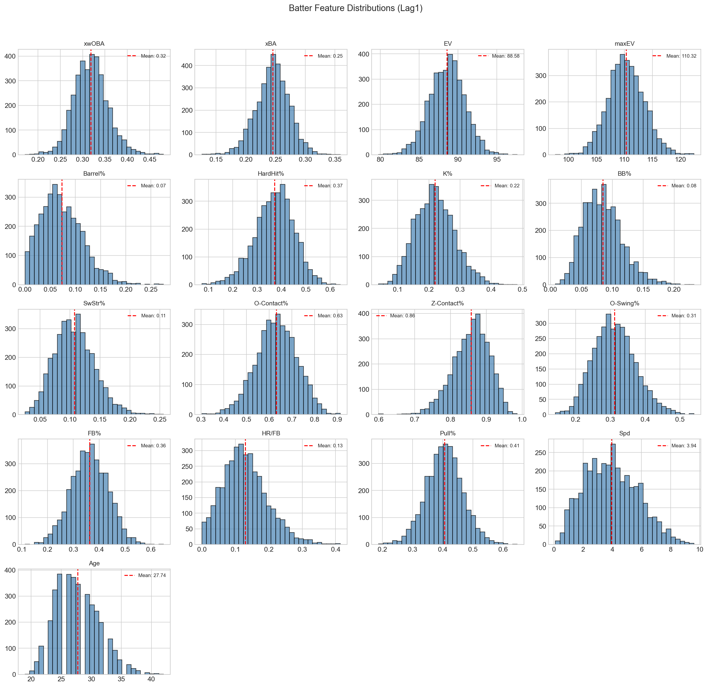
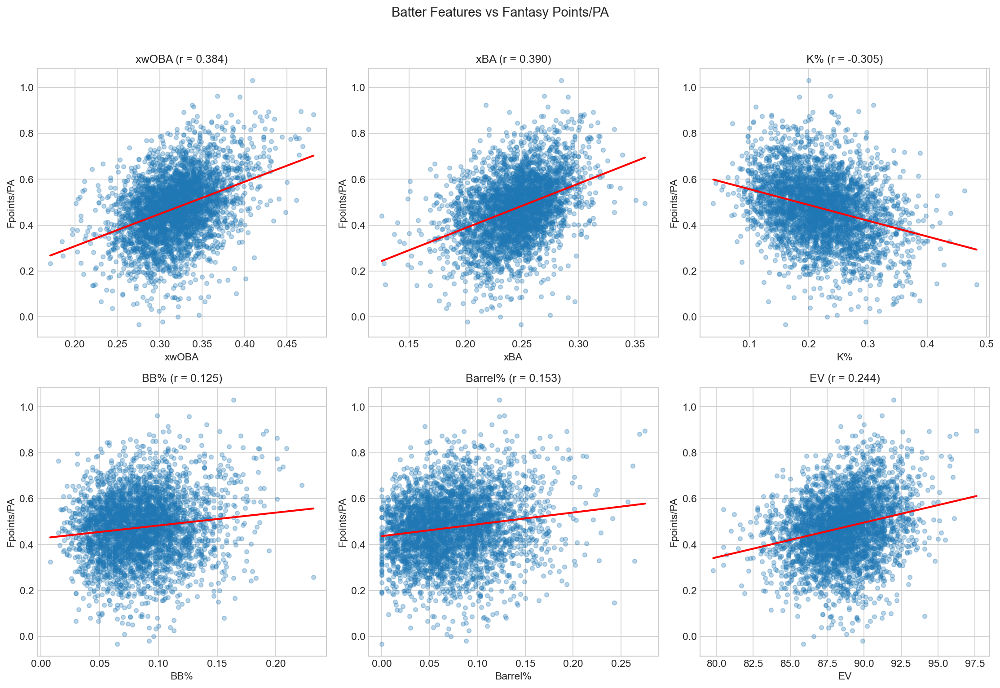
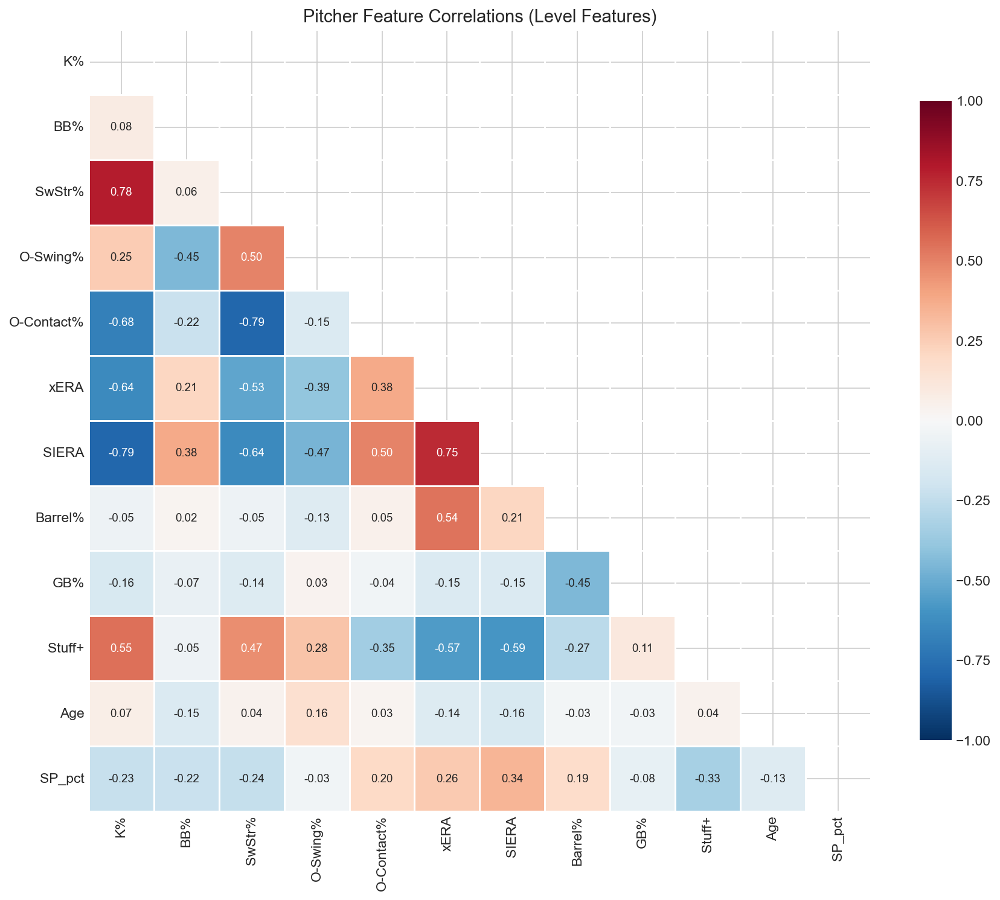
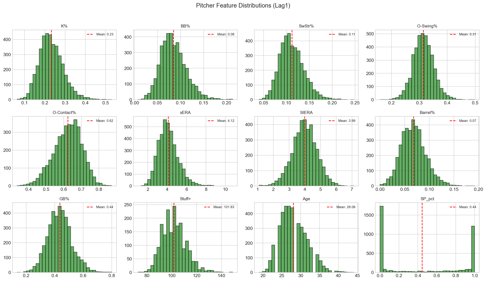
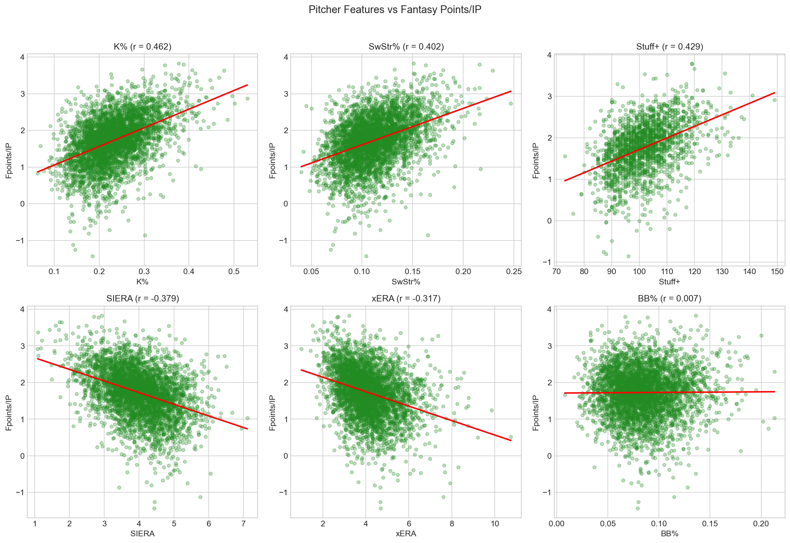
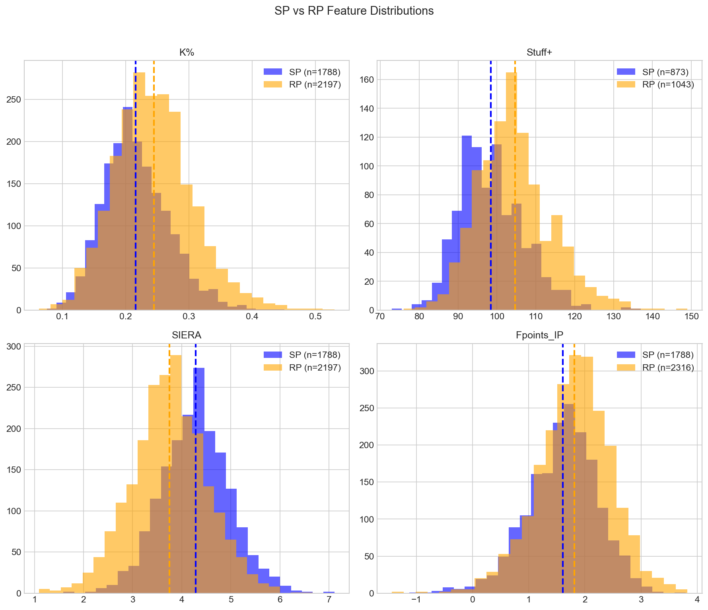
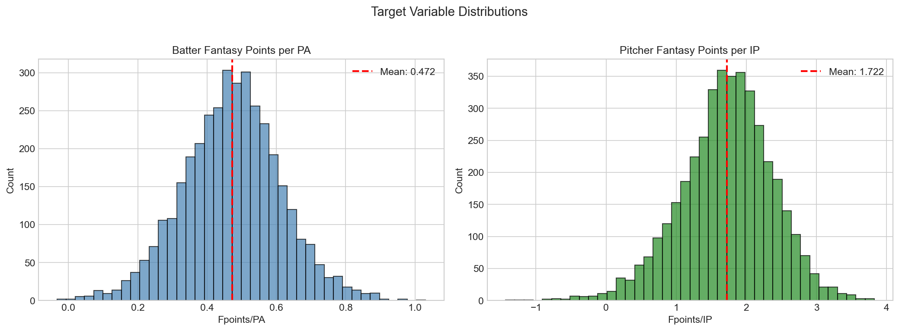

# Feature Selection + Engineering + EDA

## Choice of features + EDA:
As mentioned previously interpretability is very important in this model - and therefore keeping all 300+ features in the model would be an abomination. 

Therefore I selected the following features for each model based on my knowledge and a small correlation analysis. 

**Batters**:
  - xwOBA
  - xBA
  - EV
  - maxEV
  - Barrel%
  - HardHit%
  - K%
  - BB%
  - SwStr%
  - O-Contact%
  - Z-Contact%
  - O-Swing%
  - FB%
  - HR/FB
  - Pull%
  - Spd
  - Age

  We see the correlations are as follows: 
  
  There are strong correlations between some of the batted ball metrics and expected stats, coming as no surprise. Something I found interesting here is the negative correlation between zone and out of zone contact % and Barrel %. This indicates that in order to barrel the ball more frequently, contact skills have to be sacrificed a significant amount. 

  Below are the distributions of each feature - which are all approx. normally distributed as expected:
  

  Taking a look into some of the correlations with fantasy points can give us an idea of how the model should value these features. 
  

  We see that xBA actually is the most important feature... even above xwOBA (which indicates how poorly representative ESPN scoring is of real-life production). K% also has a very strong negative contribution, again no surprise. 

**Pitchers**:
  - K%
  - BB%
  - SwStr%
  - O-Swing%
  - O-Contact%
  - xERA
  - SIERA
  - Barrel%
  - GB%
  - Stuff+
  - Age
  - SP_pct (indicating starting pitcher or reliever)

For pitchers the correlations are as follows:

Everything as expected here. 

Histograms:

Same here - all basically normal. 

The pitcher features seem to have higher correlations with fantasy points as shown below:

Interestingly swing and miss metrics and Stuff+ correlate MORE than ERA estimators, showing how important strikeouts are in this fantasy scoring. 

It is also a worthy exercise to look at the difference between starters and relievers:

In a nutshell relievers are better than starters on an IP basis - to be expected as starters have to tone down their stuff to last 6+ innings. 

## Lag Features (Level)
As previously mentioned, lag features are utilized in an attempt to account for outlier seasons. As an example, a model trained on 2024 data would expect Bo Bichette to be a significantly below average player, although every other season in his career would indicate otherwise. In an ideal world all previous seasons would be taken into account, but there is a trade off between including prior seasons, but then having missing data for players with only one or a few seasons played. I felt that one lag feature was enough to mitigate absolute outlier seasons while not introducing an extreme amount of NaNs. 

HOWEVER, this introduced pretty extreme multicollinearity into the model, as features are very highly correlated from year to year for the same player. Although this has no effect on the actual model results as I am using tree-based models, it greatly harms the interpretability of the models. Two highly correlated features receive arbitrary amounts of weight between each other when splitting, therefore making it difficult to realize which features are truly important for a given player. 

## Trend Features (Direction)
An important piece of information that comes with the lag features is the trend or difference between the two features. The model should know the difference between a player who lost .100 points of xwOBA from season to season versus a player who remains about constant. This allows for more accurate modeling of older players declining, younger players ascending, or models of consistency. This is also something that CAN be included into the model without sacrificing interpretability, even though very similar information is conveyed. 

A binary indicator feature *has_trend* is also introduced to tell the model if the trend feature is imputed. Imputation is currently just done with the median, therefore giving the model this context is important to ensure it can correctly utilize the trend feature. 

## Target Feature (Fantasy Points):

Taking a quick look into our response variable of fantasy points, we see normal distributions for both batters and pitchers:

