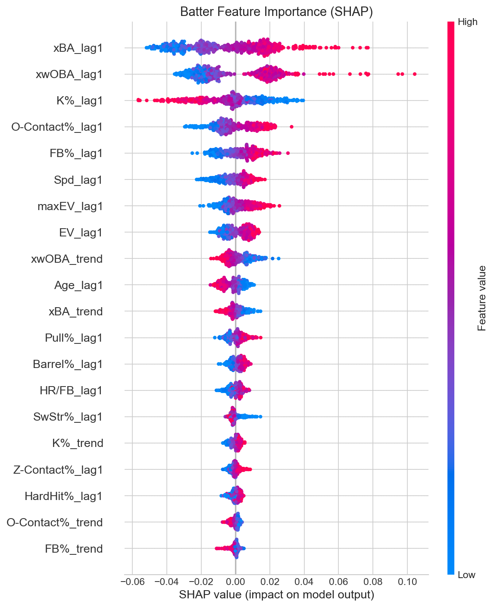
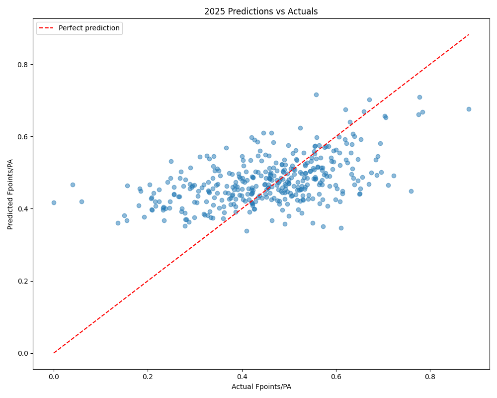
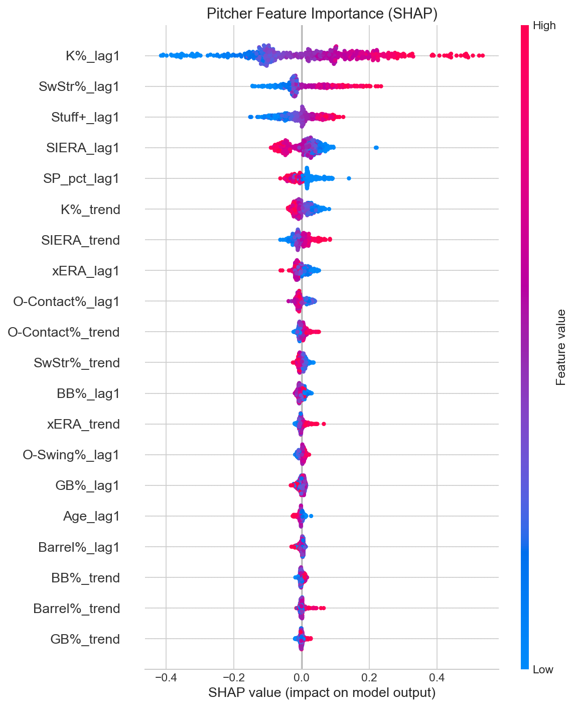
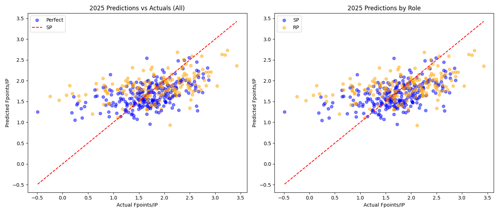
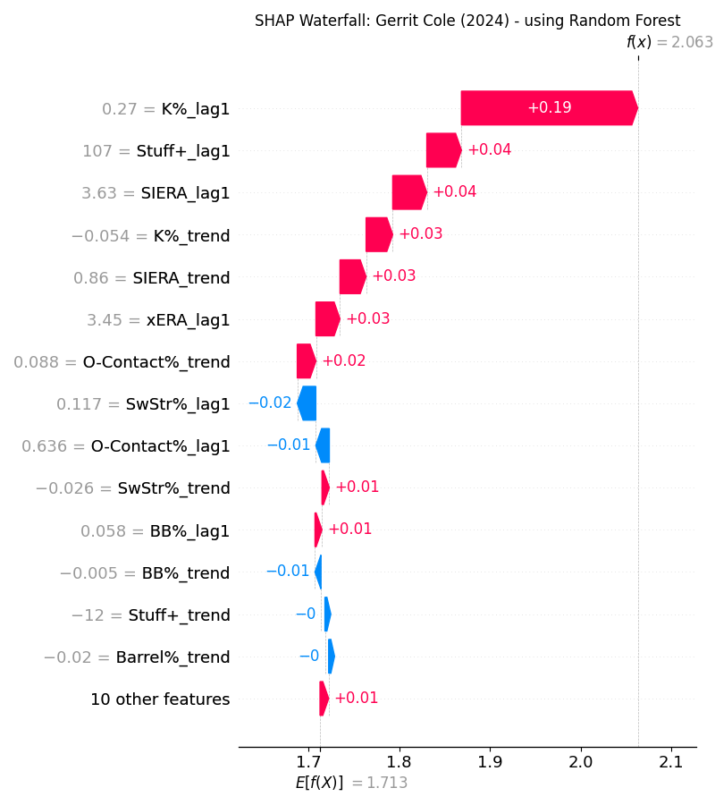
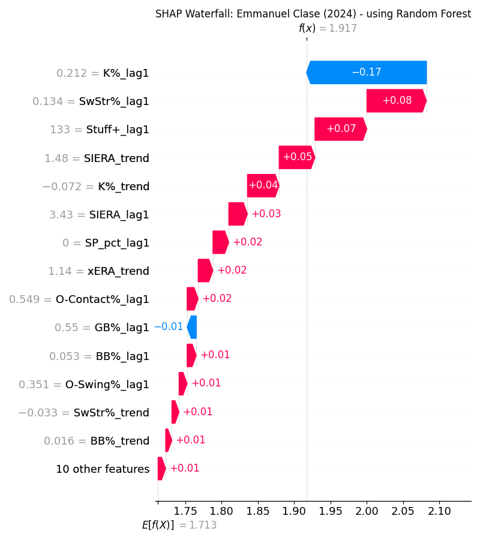
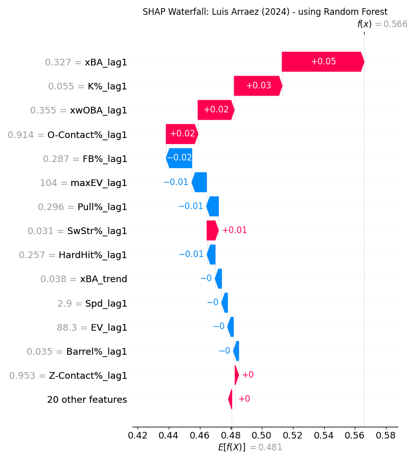
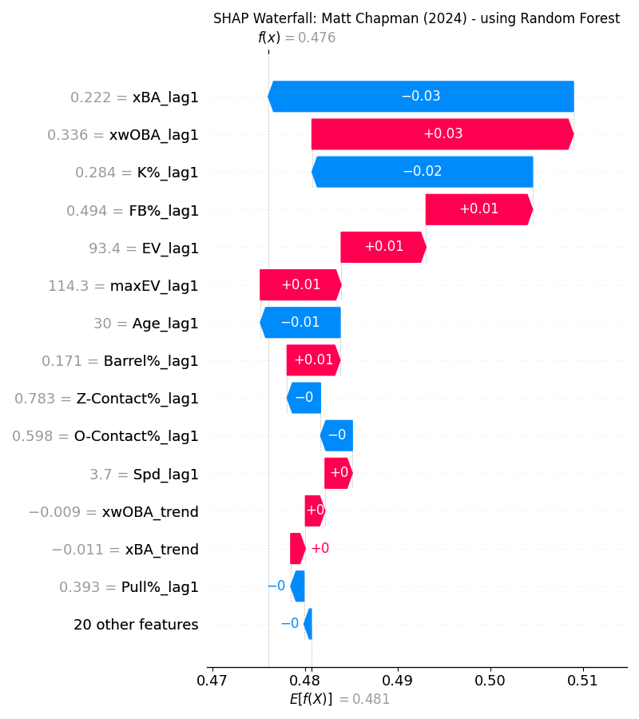

# Model Training & Evaluation

From there we move on to training our model. As mentioned previously we use 2015-2023 fantasy points as training data, and keep 2024 & 2025 fantasy points for validation. 

Preprocessing includes simple z-score scaling along with imputing the mean for missing values (rookie lag features as previously mentioned). 

I stuck with the tree model family for this exercise, as this is what has performed the best for me in past endeavours. Linear regression has also produced strong MAE and R² metrics, very similar to the capabilities of tree models, however that fact that the features are not linearly related makes these model invalid. Originally I tested LightGBM, CatBoost, XGBoost and Random Forest models, tuning for the main hyperparameters such as tree structure and regularization. From this I determined Random Forest would perform the best for both the batter and pitcher models, narrowing down the search space. 

## Results

### Batter Model Performance
Model metrics were as follows:
Model      MAE     RMSE       R²
Random Forest 0.092515 0.119008 0.234506

Indicating the average prediction was ~0.1 fantasy points per AB off. This is a relatively low correlation, but to be expected due to the nature of the problem. 

Below is the SHAP plot for the entire model:

We see similar features at the top as identified in the EDA - xBA, xwOBA, and K% contribute the most. Essentially all of the feature importances follow as expected - ie. higher barrel % improves the model prediction, downward trend in xwOBA decreases the model prediction. The one I found somewhat interesting was the positive correlation between Pull% and fantasy points. Maybe the idea of "using the whole field" isn't optimal?

We see in the scatter of predictions vs actual the model in 2025 that the model is conservative on the tails - really bad players are given some grace while the elite of the elite are grouped in with the mortals. 

### Pitcher Model Performance
Model metrics were as follows:
Model      MAE    RMSE       R²
Random Forest 0.416747 0.53755 0.213103

The error metrics are larger in magnitude, however the R² indicates relatively similar performance to the batter model. 

The shap plot again:

We see a LARGE contribution from K% - quantitatively it is almost 3x more important than the rest of the features. This follows the strikeout biased ESPN scoring system along with the fact that strikeouts correlate well to dominant pitching in general. Interestingly, the SP/RP feature comes in as the 5th most important, favouring relievers over starters. This follows from the EDA prior, and remember this is predicting fantasy points PER INNING, where relivers shine.

We see similar homogenity in the scatter of 2025 predictions with the extremes being less extreme and a slight bias towards relievers:

## Model Interpretation
Below I will show two individual SHAP waterfall plots for each model - one that predicts well, and one not so much. This works to give a quick overview of how the model prioritizes features and what archetypes of players it is good/bad at predicting. 

#### Pitchers:
Good: Gerrit Cole - High strikeout high stuff pitcher
=== Gerrit Cole (2024) ===
Team: NYY | Role: SP
IP: 95.0 | G: 17 | GS: 17

Actual Fpoints/IP (skill): 2.158
Predicted Fpoints/IP (skill): 2.063
Error: -0.095

Total Skill Fpoints (actual IP):
  Actual: 205
  Predicted: 196

Actual W/L/SV/HLD: 8-5, 0 SV, 0 HLD
  Team-based points: 6
  Total actual (skill + team): 211

Poor: Emmanuel Clase - Elite at everything EXCEPT strikeouts. Don't gamble on Clase in this years draft though. 

=== Emmanuel Clase (2024) ===
Team: CLE | Role: RP
IP: 74.1 | G: 74 | GS: 0

Actual Fpoints/IP (skill): 3.094
Predicted Fpoints/IP (skill): 1.917
Error: -1.178

Total Skill Fpoints (actual IP):
  Actual: 229
  Predicted: 142

Actual W/L/SV/HLD: 4-2, 47 SV, 0 HLD
  Team-based points: 239
  Total actual (skill + team): 468

#### Hitters:
Good: Luis Arraez - the poster boy of ESPN fantasy - extremely low whiff, high contact with minimal power.
=== Luis Arraez (2024) ===
Team: - - -
PA: 672

Actual Fpoints/PA: 0.570
Predicted Fpoints/PA: 0.566
Error: -0.004

Total Fpoints (actual PA):
  Actual: 383
  Predicted: 380

Bad: Matt Chapman - low contact player who still gets slightly buoyed by good batted ball metrics:
=== Matt Chapman (2024) ===
Team: SFG
PA: 647

Actual Fpoints/PA: 0.561
Predicted Fpoints/PA: 0.476
Error: -0.085

Total Fpoints (actual PA):
  Actual: 363
  Predicted: 308

