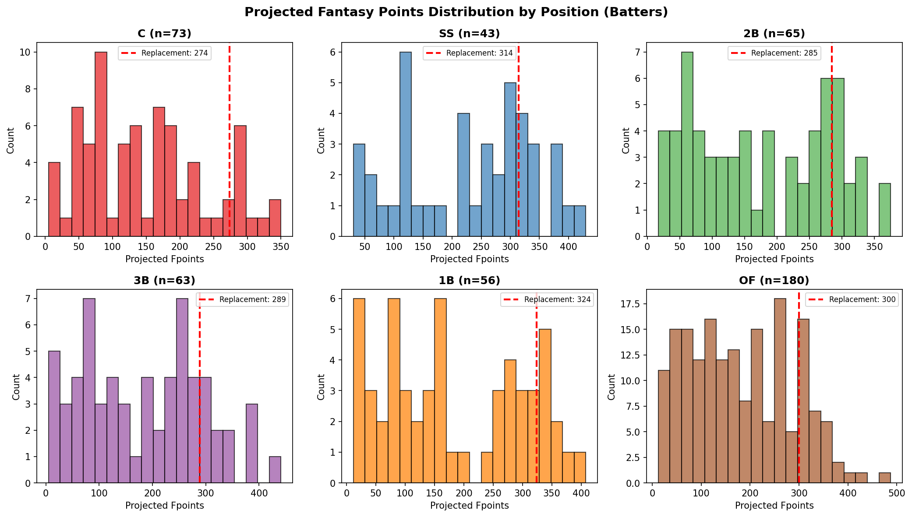
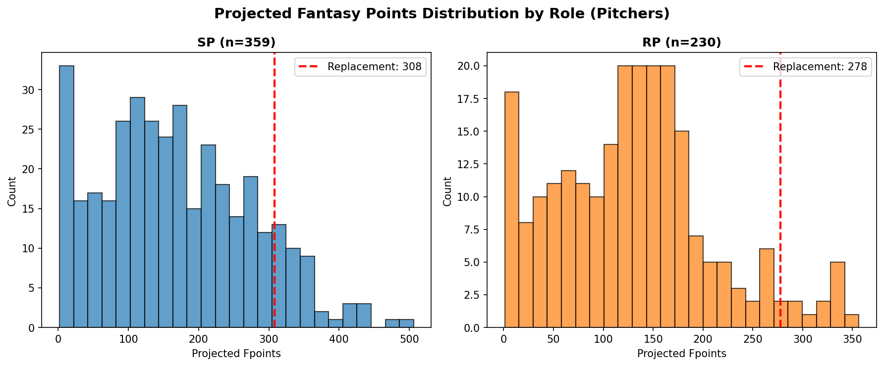
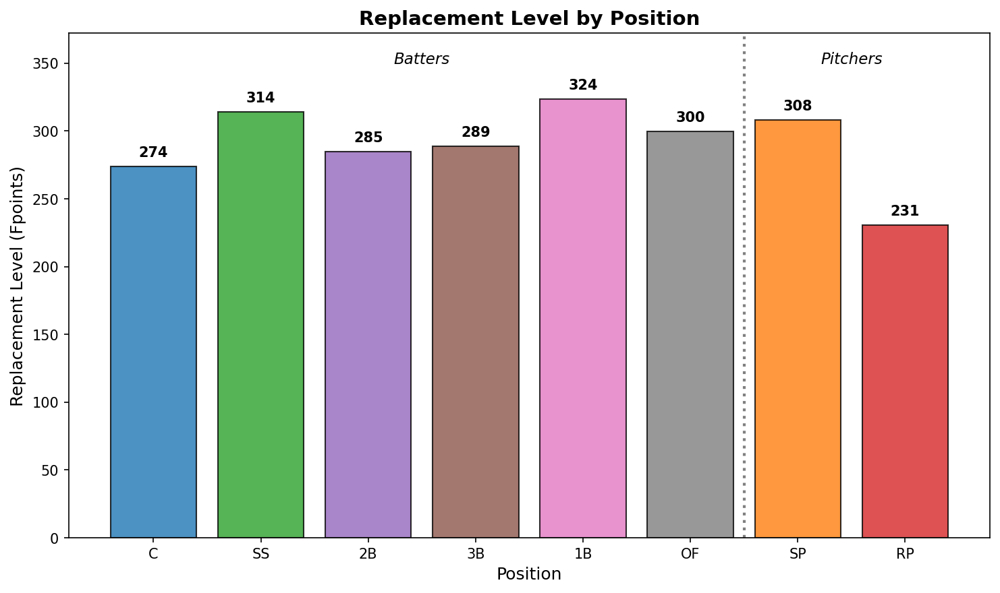
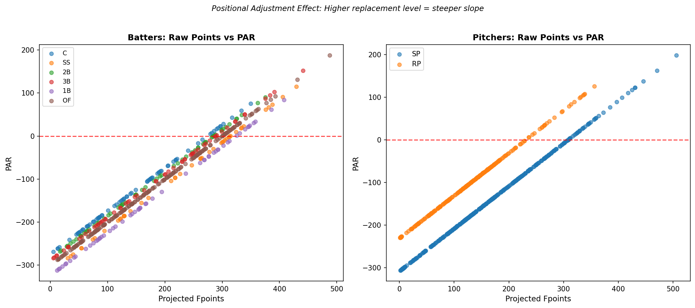

# Points Above Replacement (PAR)

Points Above Replacement (PAR) is used to adjust for differences in performance throughout entire positions. This becomes quite impactful due to the positional restrictions imposed by ESPN, essentially limiting to one of each position on the hitting side (3 OF and 1 UTIL). Therefore we not only need to compare players relative to all others, but we also need to compare players within their position pool. As an example, take Player A as a 2B and Player B as a 1B. Player A is projected 300 fantasy points, and player B is projected 350. Just from this information you would take player B, right? Now add in the extra information that the best 2B on the waiver wire, Player C is projected only 200 fantasy points; and the best 1B on the waiver wire, Player D is projected 325 fantasy points. Adding in this information now things have changed - it would be optimal to pair Player A with Player D - illustrating the effect of inter-positional rankings and the adjustments required. 

## Configuration
For these PAR calculations I assume the following (can all be changed in config/roster.py):

- The base is a 12 team league, however for PAR we set the "replacement level" at 10 to account for the UTIL slot plus players with multi-position eligibility. 
- The "replacement level" is calculated as the average of the 5 players around the threshold level (2 above, 2 below, 1 at the level) to smooth it out. 
- For hitters the roster makeup is C, 1B, 2B, 3B, SS, 3 OF, 1 UTIL
- For pitchers (7 total slots) I arbitrarily state that each team will have 2 RP (and 5 SP in turn) to reflect approximate roster construction. 
- Players with multiple positions are treated as the most beneficial position. 

## Calculation
From here calculating and applying PAR is quite simple - we find the replacement threshold for each position, take the composite average of the nearest 5 players, and simply subtract this value from each players projected fantasy points to get a position adjusted rank. 

## Results:
Below we can see the distribution of fantasy points for batters and pitchers with the replacement level noted:

We see that unsurprisingly catchers and second basemen are the scarcest positions, with first base the most bountiful. In terms of pitchers, starting pitchers have a replacement level 30 points above relievers. 

The below plot compares all replacement levels in one:

This last plot is helpful to visualize the effects of PAR - it illustrates how positions with lower replacement levels are given an "intercept boost" in order to even the playing field with more fruitful positions

