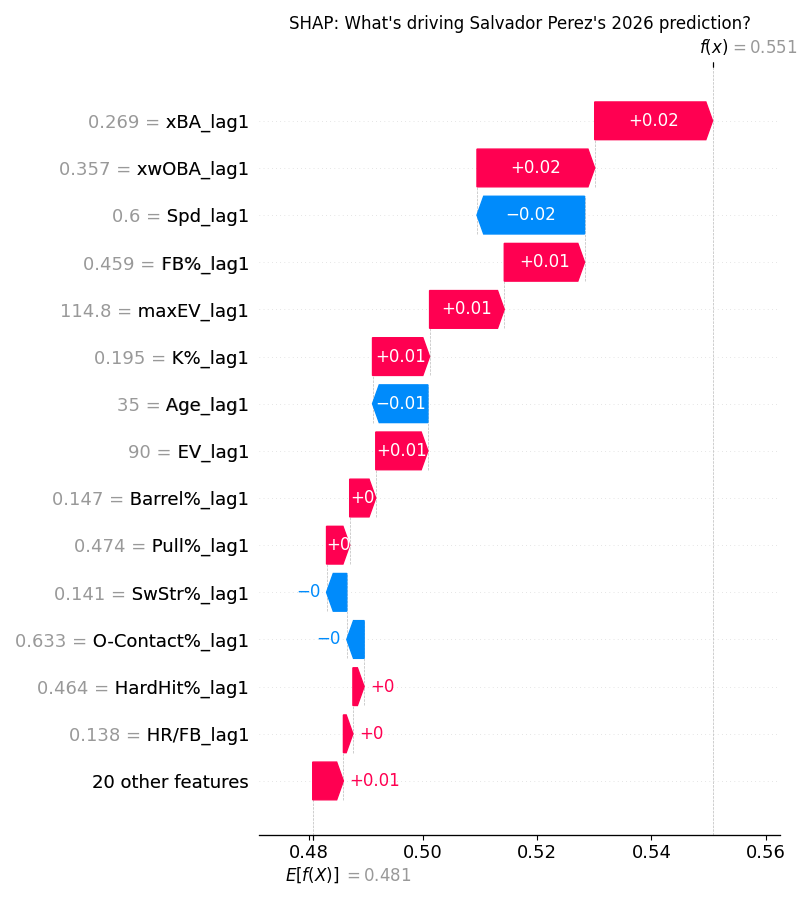
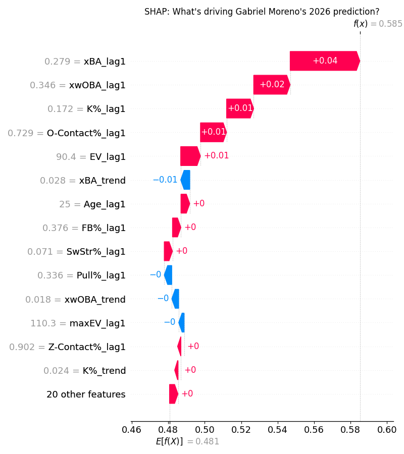
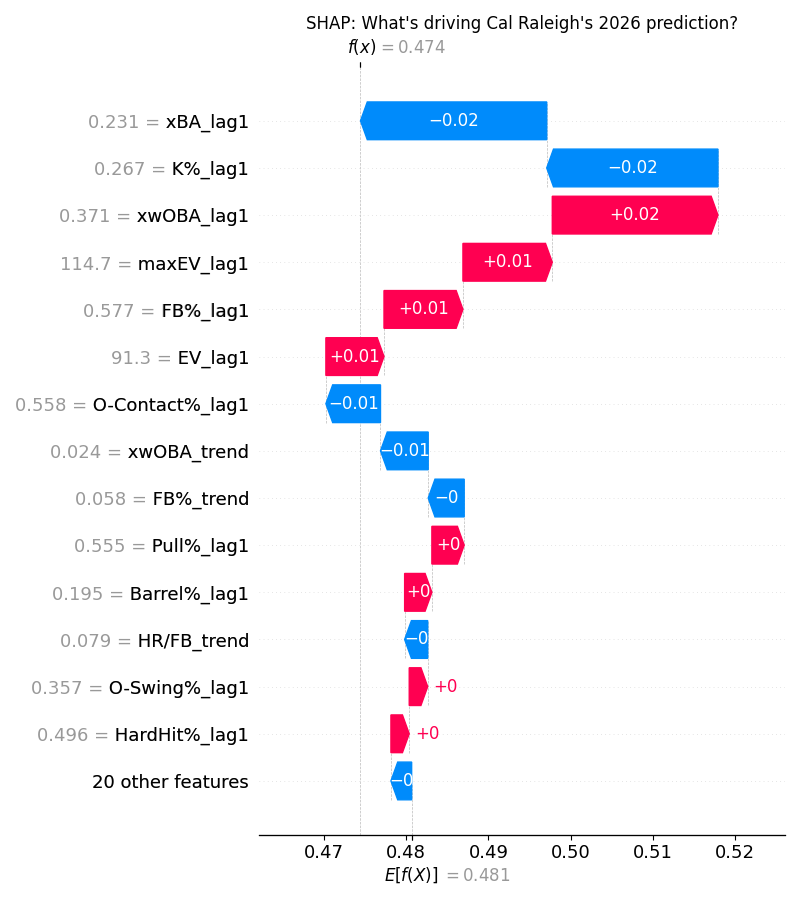

# Catchers

## Upper Tier: Salvador Perez (KCR) - ESPN Rank 108, ML Rank 53, Fangraphs Rank 67

Although Salvy had a bit of a down year last season, you wouldn't be able to tell from his metrics. He underperformed his xwOBA by 0.046 points, along with an extreme 0.088 difference between his SLG and xSLG. Perez also maintained a strong barrel rate at 14.8%, and pairing this with a top 10 percentile flyball rate of 26.6% will 9 times out of 10 produce very strong numbers. The only gripe with his offensive profile is awful plate discipline - chasing more and walking less than essentially the entire league. However this did not translate to his strikeout rate - sitting at an above average 19.5%, which also held true in 2024. The ballpark changes in Kansas City bringing in the fences should also greatly benefit Salvy, as his penchant for pulled flyballs will likely allow for more home runs. Counting stats are likely to be there as well hitting in a strong top of the order for the Royals, behind Bobby Witt Jr. and Maikel Garcia. 

## Sleeper: Gabriel Moreno (ARI) - ESPN Rank 176, ML Rank 183, Fangraphs Rank 215

If you do decide to wait until the end of the draft for a catcher, I highly recommend Moreno. One of the most underrated players in the MLB, he has posted above average seasons offensively in every season of his career by wRC+. He won't wow you with his power, however he hits a ton of hard line drives, with a 28.8 LD% (MLB Average is 24.7%). He has also posted above average K% and BB% over both the last two seasons, which are both quite important in terms of ESPN fantasy. From this information you can sense there is a pretty solid floor here with Moreno. However there may be a decent ceiling here as well. His Barrel % and Hard-Hit% last season were the highest of his career, indicating some progress with his power. What really interests me is his batted ball profile - his pull air % jumped almost 7% last year to 14.6%, and this came at the expense of his groundball rate, a strong positive sign. 

## Bust: Cal Raleigh (SEA) - ESPN Rank 12, ML Rank 86, Fangraphs Rank 26

Going to take the cop-out pick here... don't get me wrong Cal is an awesome player. However last season is completely unsustainable, and his profile is not super friendly for this fantasy format. His 19.5% barrel rate paired with an absurd 38.4% Pull Air rate led to a historic season in terms of power - the pull air rate I don't fully believe he can maintain. Strikeouts are also key here (a theme you will see throughout), as the Big Dumper strikes out a lot, 26.7% of the time last season. You will be extremely reliant on homers from Cal - which can come and go, especially playing in pitcher friendly T-Mobile Park. I definitely would not follow the ML Rank of 86, however taking Raleigh at the end of the first round is not where I would go. 

