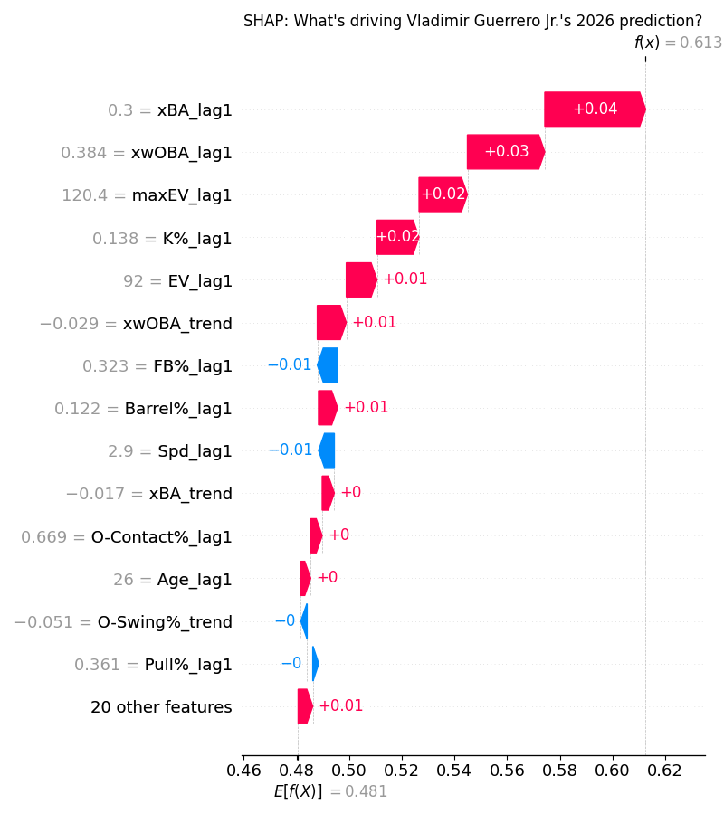
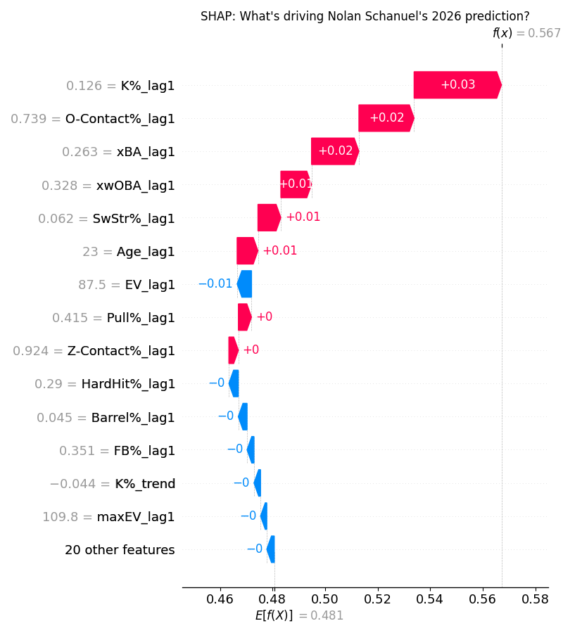
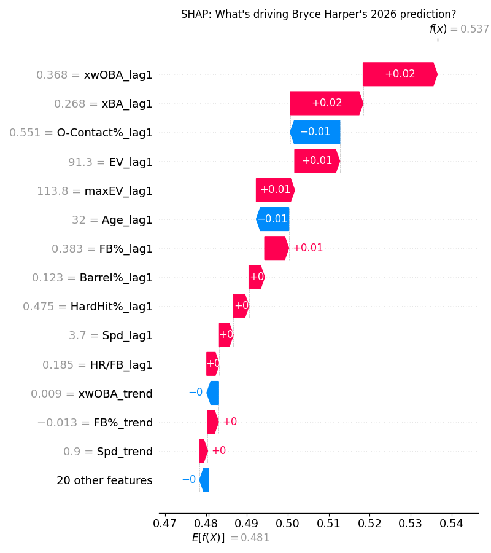

# First Basemen

It is really hard to go wrong at first base... there are so many good options. I'll highlight my favourites here.

## Upper Tier: Vladimir Guerrero Jr. (TOR) - ESPN Rank 21, ML Rank 22, Fangraphs Rank 8

Following one of the best playoffs runs we have seen in a while, Vladdy is primed for a career season. Last year Vladdy felt a bit underwhelming, as underwhelming as a 137 wRC+ and 3.9 WAR can be. There were signs of improvement though, finishing with a second half OPS 0.080 points better than the first half. And of course an ungodly 1.289 OPS in 18 games. He really doesn't have a weakness offensively besides a slight overreliance on ground balls. He walks at an 87th percentile clip, strikes out at a 90th percentile rate, and when fielders pray he hits the ball to someone else. In the scenario where he can keep lifting the ball like he did in the playoffs I would expect 35+ homers with a wRC+ teasing towards 160. I would be very happy with Vladdy as a late first round pick - the ESPN rank at 29 is very silly. 

## Sleeper: Nolan Schanuel (LAA) - ESPN Rank 245, ML Rank 105, Fangraphs Rank 204

Schanuel, known for his very quick ascent to the majors, has been solid through his first two seasons, totalling around a 110 wRC+. Nothing about him is super exciting - he doesn't have much power at all, not an elite athlete. His power is actually very poor, averaging a 4th percentile bat speed of 67.5 mph. So why take this guy? He runs elite strikeout and walk rates paired with great bat-to-ball skills and a penchant for line drives. This gives him a very solid floor as a serviceable end of the roster guy. There is potential for growth here if he is able to develop some bat speed, as the batted ball profile (specifically the pull FB%) is pretty solid actually. I wouldn't bank on him becoming a top 50 player, however if you somehow get to the end of your draft needing a first basemen Schanuel will definitely be there. 

## Bust: Bryce Harper (PHI) - ESPN Rank 89, ML Rank 136, Fangraphs Rank 54

Maybe I am getting some Harper fatigue, but I feel that this season may be a step down from what we have come to expect. Over the last two seasons Harper's metrics have ever so slightly decreased, with most batted ball metrics (EV, xwOBA, etc.) dropping from around the 90th percentile to more the 80th. Harper became much more aggressive last season, specifically on the first pitch with his first pitch swing rate jumping 6.7%. This led to an increased whiff rate of 4% up to 30.7% overall for the season. Although that did not result in an increased strikeout rate, the correlation between the two suggests it is highly possible this year. Harper also produced about equal to his expected stats last season in terms of wOBA/xwOBA and SLG/xSLG. This may burn me, but I don't see a world where Bryce returns to his peak form in 2026. 

