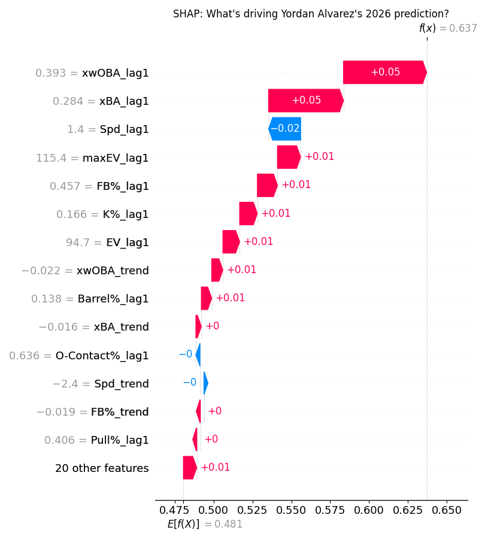
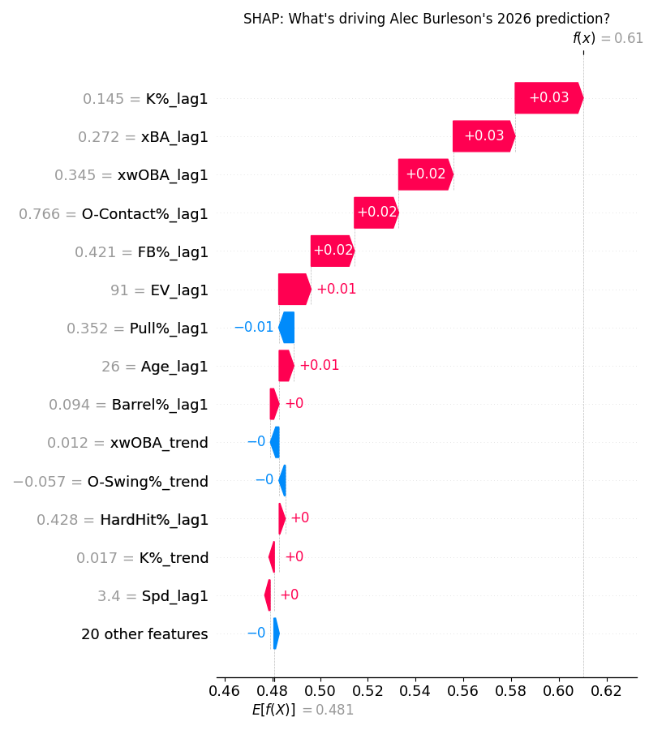
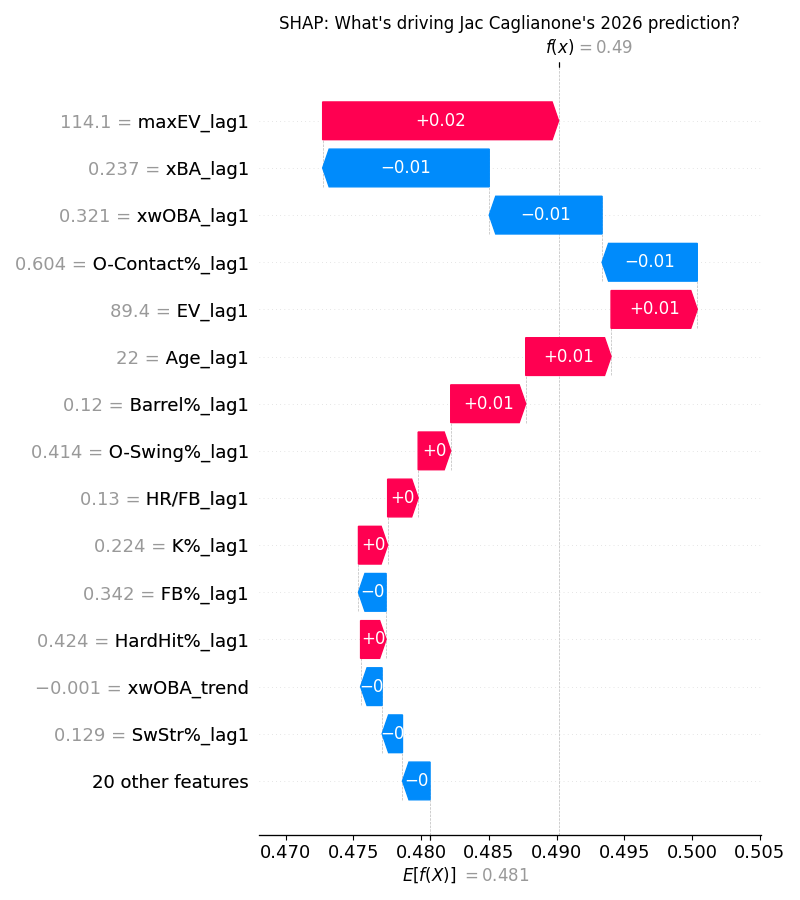
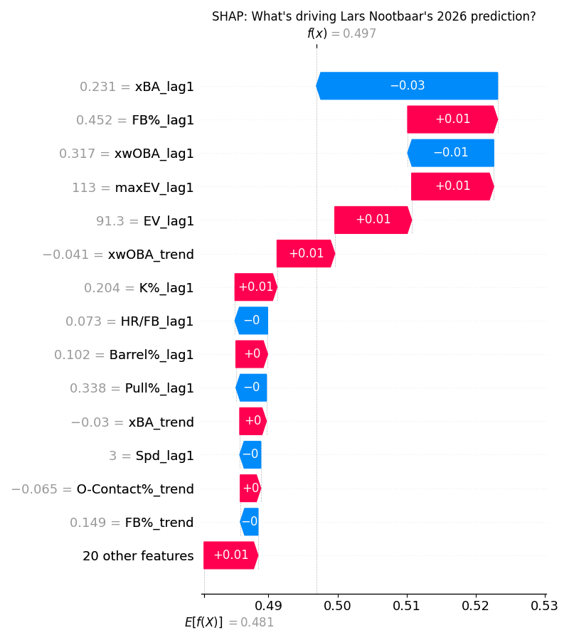
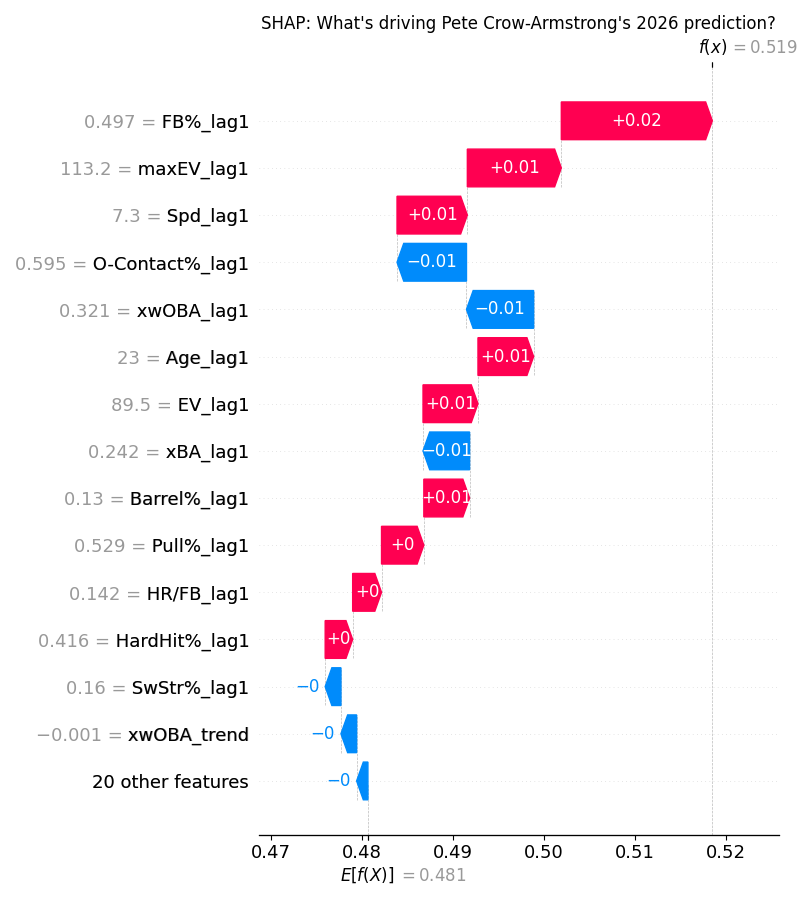
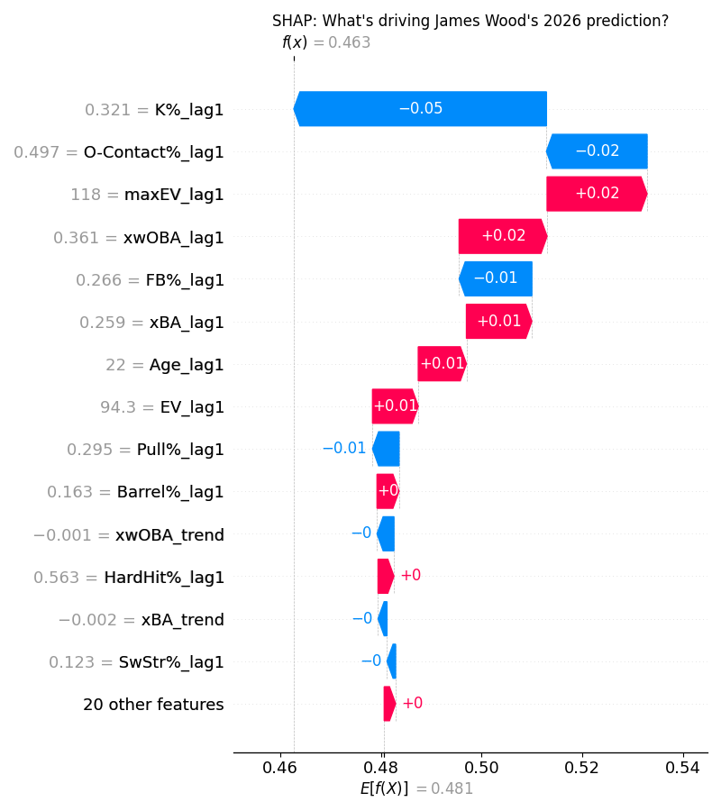

# Outfielders

Since we have 3 outfield slots per team, I will provide 2 options per tier. 

## Upper Tier: Yordan Alvarez (HOU) - ESPN Rank 38, ML Rank 45, Fangraphs Rank 15
The ML Rank here gets biased from essentially only using one season sample. No explanation as to why ESPN has Yordan so low besides maybe injury risk. He only played 48 games last season due to a very poorly managed broken hand (thanks Astros medical staff), and also struggled to easily the lowest wRC+ of his career at 118. Even so, his baseball savant page was still a sea of red, with not one single metric below league average. In 2024 Yordan fell into the following percentiles: 99th in xwOBA, 99th in xSLG, 95th in Avg EV, 92nd in Barrel%, 97th in bat speed, 88th in K%, and 82nd in BB%. Its pretty easy to see why Fangraphs projections all have him above a 150 wRC+ for this upcoming season, and also easy to see why you should draft him. 

## Upper Tier: Alec Burleson (STL) - ESPN Rank 142, ML Rank 42, Fangraphs Rank 72
Burleson took another step forward in 2025 putting up a very strong season (at the plate at least) with a 124 wRC+. He profiles very nicely for ESPN fantasy with his 86th percentile K% of 14.5% in 2025. He won't wow you with exit velocities or bat speed, however they do both sit above league average, with a 55th percentile bat speed and a 72nd percentile exit velocity. This combined with his ability to square up the baseball produced some very respectable expected stats last season, which his true numbers reflected. A big reason for his growth came from a newfound element of patience at the plate, as Burleson went from a 55.7 Swing % in 2024 to a 49.3 Swing % in 2025 (for reference league avg Swing% is 47.3%). This did lead to a slight increase in K%, however that was offset by more walks along with less weak contact. Burleson is a great steady option to take, especially given the ESPN rank. 

## Sleeper: Jac Caglianone (KCR) - ESPN Rank > 300, ML Rank 262, Fangraphs Rank 327
Caglianone struggled in his short stint in the majors, posting only a 46 wRC+ in 62 games. That doesn't tell the whole story here however, as his .321 xwOBA was around league average. He also barreled 12% of his batted balls, a solid 5% above league average.The main allure here is the ridiculous bat speed and exit velocities, including a double that reaches 120.2 mph EV this spring. He has also been crushing in the WBC with Team Italy, posting a 1.290 OPS. The power potential here is just too much to pass up, especially as a flyer at the end of drafts. Especially with the fences being moved in at Kauffman Stadium. He is a popular breakout pick, meaning you may have to go a round or two before the end of the draft, however Jac is well worth a shot. 

## Sleeper: Lars Nootbaar (STL) - ESPN Rank 260, ML Rank 230, Fangraphs Rank 201
Nootbaar had a down season last year, posting a wRC+ below 100 for the first time since his 58 game stint as a rookie. Unlike some of these other picks, it wasn't a bad luck season. In 2024 Nootbaar posted a 6.0 average launch angle - quite low compared to the league average of 12.4. It was obvious there was a concerted effort to fix this issue in 2025, as his average launch angle jumped to a whopping 16.5 degrees. Pair that with a middling ability to pull the ball (15.2% pull rate), and it can be seen why Nootbaar struggled a bit. Straight away and oppo flyball are generally not a great recipe for success. I do see a world where he balances out this launch angle in 2026, allowing him to reclaim or even best his 2022-2024 numbers (avg wRC+ around 120). There may be a slight concern with the increase in chase, as his chase rate was up 5% in 2025, however I like Lars to regain his form as a firmly above average hitter in 2026. 

## Bust: Pete Crow-Armstrong (CHC) - ESPN Rank 63, ML Rank 85, Fangraphs Rank 107
PCA is an awesome baseball player. Possibly the best fielder in the MLB, and he posted a 30 HR/30 SB season in 2025. There are just some concerns with his profile that really bottom out his floor. The main issue is his plate discipline - PCA chased at a monstorous 41.7% rate in 2025, leading to a 4th percentile BB% of 4.5 and a 33rd percentile K% at 24.0. He rode a ridiculous 30.2 Pull Air% last season, which I am a bit skeptical he can maintain in 2026. Unless he cleans up his plate discipline, I would guess PCA ends up outside the top 100 this season. 

## Bust: James Wood (WSN) - ESPN Rank 88, ML Rank 160, Fangraphs Rank 122
Not much else to say here besides strikeouts. Wood is awesome at everything else, however a 32.1% K rate is pretty hard to overcome in the ESPN points league format. The main reason for this is is his swing path - which averages a 40 degrees angle on the swing. That is very high compared to the league average of 32 degrees, meaning his bat exits the zone very quickly. That is really all I have to gripe about with Wood, but the severity of the whiff issue really hurts. 

