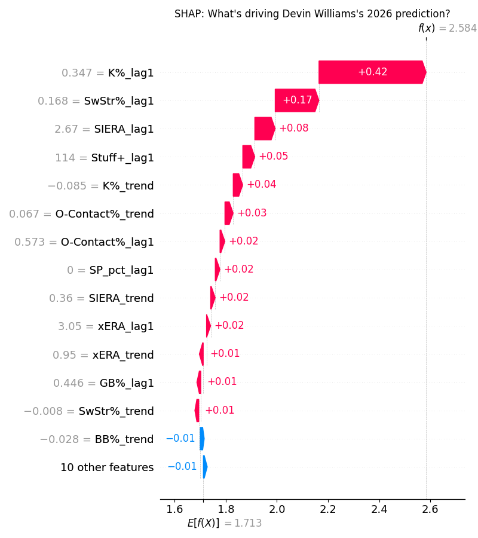
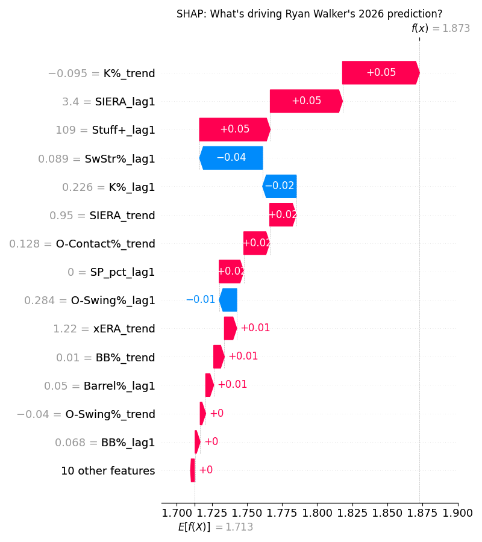
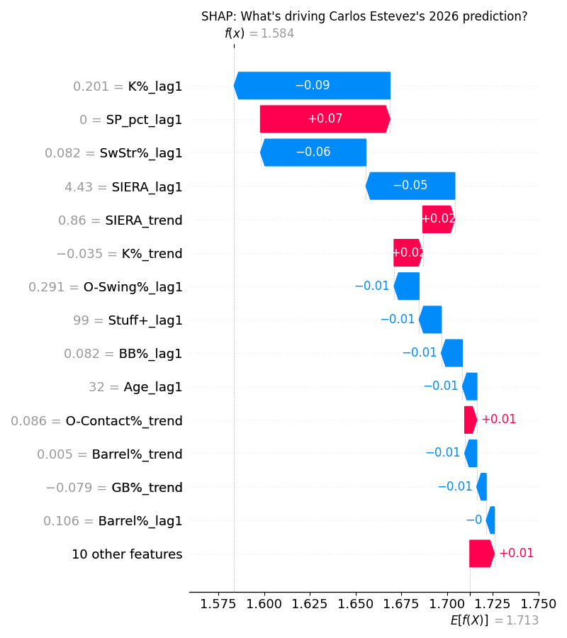

# Relief Pitchers

Relief pitchers are easily the most difficult position to predict due to the large variance and importance on saves. Bad relievers who can accrue 40 saves will likely perform better than Mason Miller if he only recorded 20 saves. However I will still provide one pick per tier here. Note also the Fangraphs adjusted ranks for relievers are far more inflated than they should be. 

## Upper Tier: Devin Williams (NYM) - ESPN Rank 73, ML Rank 39, Fangraphs Rank 25
Williams had a rough season with the Yankees last season, losing the closer job due to his performance. That culminated in a 4.79 ERA to end the season, easily the highest of his career. What went wrong? He gave up far more barrels and hard contact in 2025, gaining almost 4% in barrel% from 2024 to 2025. There was no decrease in his stuff, with both his Fangraphs stuff+ and tjstuff+ remaining essentially the same. I would tend to chalk this up to bad batted ball luck, backed up by a career high .296 BABIP and ridiculous 55.2% LOB rate, the latter the lowest in the league (min 50 IP). These are obvious indicators of a rebound in 2026, not to mention the airbender changeup is still arguably the nastiest pitch in the league. A move to the Mets, a team with winning aspiriations, where he should close again doesn't hurt either. If you like taking relievers early take Williams. 

## Sleeper: Ryan Walker (SFG) - ESPN Rank 253, ML Rank 172, Fangraphs Rank 79
Following an electric 2024, Walker struggled in 2025, losing the closer job to Randy Rodriguez. However Rodriguez underwent Tommy John at the end of last season, leaving Walker as the defacto closer in 2026. Walker is an extreme horizontal pitcher, throwing just a sinker and slider that essentially fall on the zero horizontal line on both sides of a pitch movement plot. Walker still limited hard contact well in 2025, ranking in the 93rd percentile in average EV against. What went wrong was the whiffs - losing 7% on his whiff rate from 2024 to 2025. If he can even partially regain his whiffability in 2026 I would expect a season more similar to his 2024 where he posted a 1.91 ERA. The Giants are also a decently competitive team, presenting many opportunities for saves. For a guy you can almost get in the last round, Walker is a great pick. 

## Bust: Carlos Estevez (KCR) - ESPN Rank 166, ML Rank 175, Fangraphs Rank 94
Estevez had a great year on the surface in 2025, posting 42 saves to lead all of MLB with a 2.45 ERA. However he only struck out 20% of batters faced, with an 8th percentile whiff rate at 19% not exaclty hinting at possible improvement there. He also gives up a ton of flyballs and line drives, with a 74.6 Air% sitting nearly 20% above league average. Yet he only ran a 5.2% HR/FB rate, with league average sitting around 10%, something that will likely fall back the norm in 2026. Spring training has been concerning to say the least for Estevez, with his four-seamer sitting at only 88.6 mph on average, down a whopping 7 mph from 2025. Although it won't remain this low, there is definitely an argument to be made that the stuff will be way down this year. My prediction is that Lucas Erceg takes over the closers role by the end of June. Avoid Estevez. 

