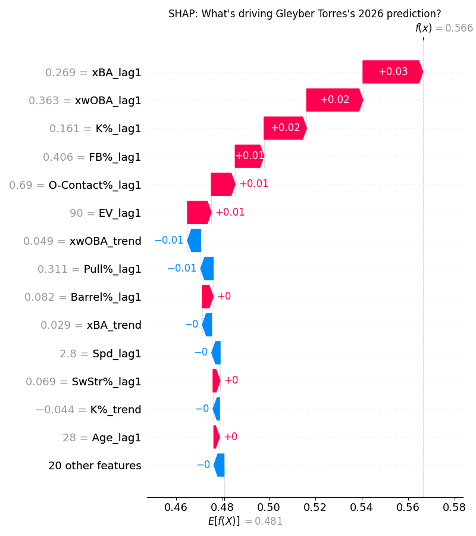
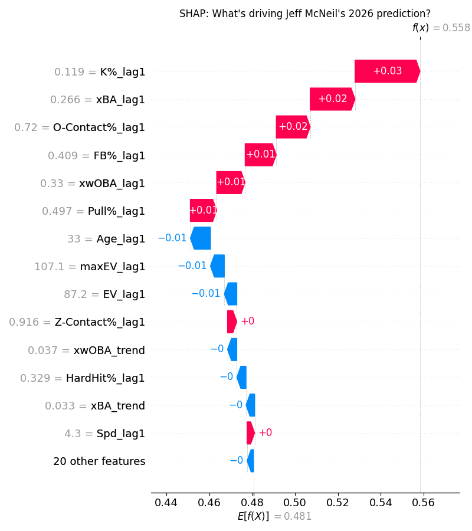
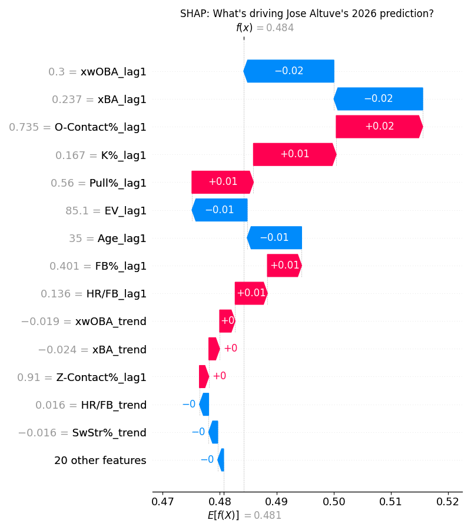

# Second Basemen

## Upper Tier: Gleyber Torres (DET) - ESPN Rank 94, ML Rank 25, Fangraphs Rank 57

Gleyber has a perfect player mold for this ESPN fantasy format. His approach at the plate dramatically improved last season, as he dropped his K% by 4% while simultaneously increasing his BB% by 4%. This all boiled down to his swing decisions; his chase rate of 17.1% was a career low by far (also 100th percentile in all of MLB), and in general he was swinging less. We won't see any more 30 HR seasons out of the former Yankee with this new approach, but the consistency will be far improved. Gleyber also underperformed his xSLG and xwOBA significantly last season, and although some of this underperformance can be attributed to his line drive + full field approach, it can be reasoned that he could be even better this season. If you want to fill a generally scarce position early - take Torres. 

## Sleeper: Jeff McNeil (ATH) - ESPN Rank 234, ML Rank 111, Fangraphs Rank 175

I am very bullish on McNeil this upcoming season. The first point is simply the team and park change - playing a Sutter Health Park is amazing for hitters. Secondly, McNeil has made some changes to his batted ball profile over the last few years that will suit the short fences well. Through his best years with the Mets McNeil profiled as your prototypical slap hitter - lots of line drives, barely any swing and miss but with very limited hard contact. This has changed recently, as Jeff recorded the highest Barrel % of his career last season, while also pulling the ball in the air at a 26.9% clip. This is up over 10% from his 2020-2022 pull air rates. These gains also have not affected his whiffability at all as his K% remained in the 94th percentile. To top it all off McNeil walked 3% more last season as well. I wouldn't be surprised at all if Jeff McNeil approaches 20 HR and a 120 wRC+ next season. 

## Bust: Jose Altuve (HOU) - ESPN Rank 49, ML Rank 130, Fangraphs Rank 82

The sun may be setting on a great career for Jose Altuve. He has ridden a pull heavy approach to consistently overperform the "statcast bubbles" throughout his career, but last year he was down essentially across the board. Less barrels, less line drives, more chase, you name it. Last year saw a dramatic shift in batted ball profile with far more flyballs and less groundballs and line drives - which could be a positive thing. However Altuve's soft contact rate was also up, coinciding with a slow decline in exit velocity. This indicates a lot of these flyballs were very weak. Going into his age 35 season it would be hard to imagine a renaissance here, unless Altuve learns some tricks from his old buddy George Springer. Altuve does rarely miss games, however he is not someone I would be hunting this season. 

