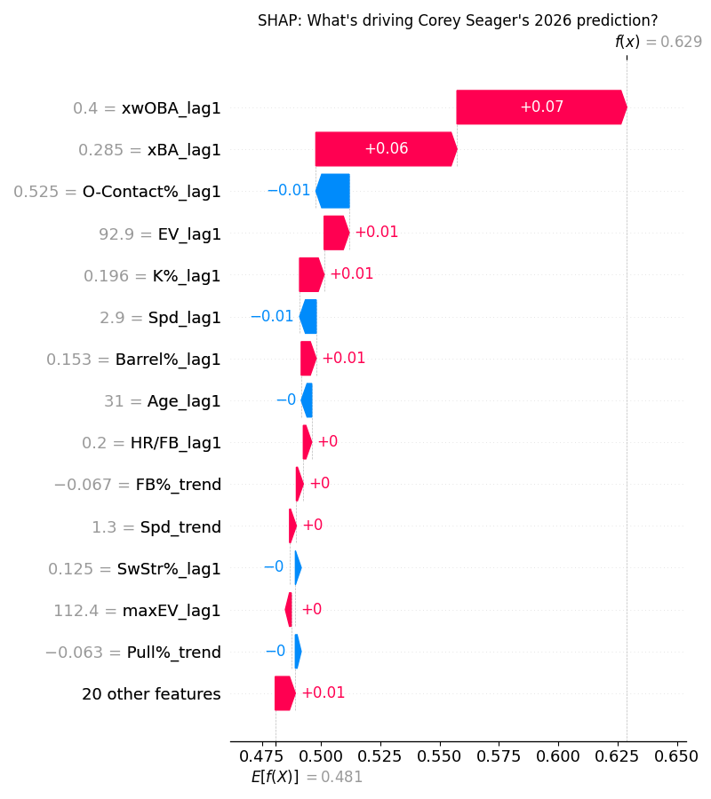
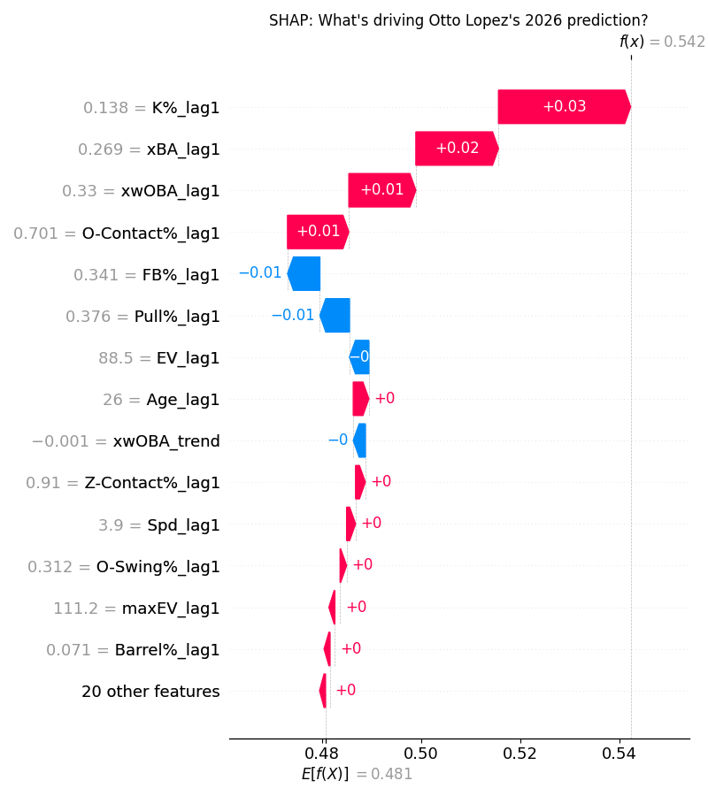
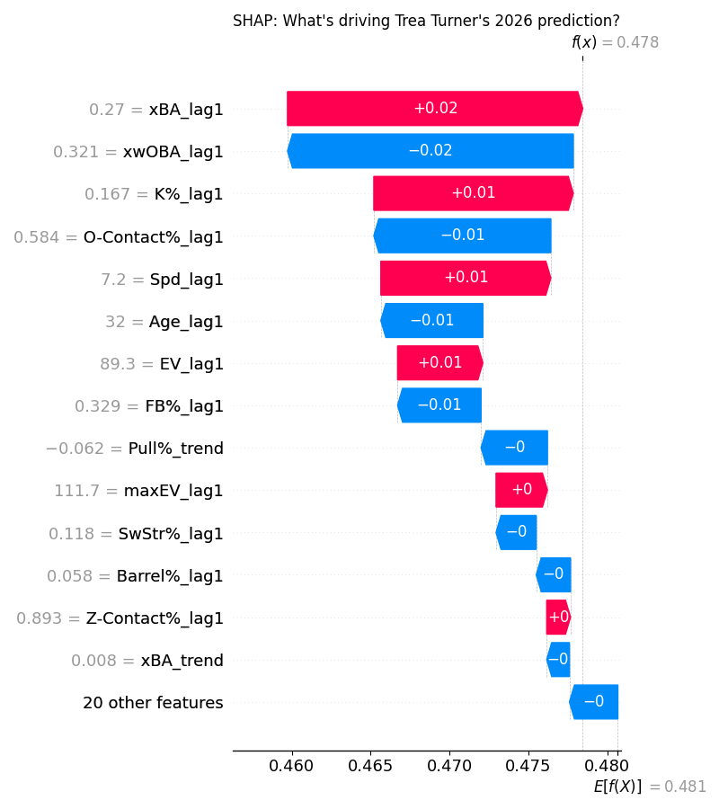

# Shortstops

Note that shortstop is very deep this year, therefore the positional adjustment is one of the most severe here. 

## Upper Tier: Corey Seager (TEX) - ESPN Rank 102, ML Rank 98, Fangraphs Rank 120

This seems like a very obvious pick to me with the only concern being the injury history with Seager. ALL of the rankings seem way too low. He has consistently been one of the most productive hitters in the league with a low wRC+ of 138 over the last three seasons. His savant page is a work of art - 90th percentile or above in metrics such as xwOBA, Barrel%, Average EV and BB%. Last year there was a shift in Seager's batted ball profile as he appeared to try and use the whole field more - leading to a 6% decrease in pull rate, most of which got shifted to straight away. This is an interesting trend but showed no adverse effects on his results. The expected stats give optimism that Seager could be even better this year, as he underperformed his xwOBA by 0.035 and his xSLG was a whopping 0.080 points above his true SLG. If Seager is able to play 150 games this season, don't be surprised if he hits 40 homers with a wRC+ above 150. 

## Sleeper: Otto Lopez (MIA) - ESPN Rank 166, ML Rank 101, Fangraphs Rank 155

Although the basic statistics don't say so, Lopez took a step forward last season as a hitter. Lopez only posted an 86 wRC+ last season, down from 92 in 2024. However, his quality of contact metrics almost increased across the board, including a 2% increase in barrel rate to 7% and a 0.030 point jump in xSLG. Notably, his bat speed also increased 1 mph to 71.7, about league average. There appeared to be an effort to pull the ball in the air more last season as well, with Lopez raising his pull air % from 8.7% to 11%. What I am most interested in here is the potential upside - if Lopez could continue to develop these gains in fields such as bat speed and batted ball distribution there is a world where he could become an above average hitter. Pair that with a 90th percentile K% of 13.8%, and you can see how Otto Lopez could be a very valuable late round pick. 

## Bust: Trea Turner (PHI) - ESPN Rank 80, ML Rank 182, Fangraphs Rank 111

I've spent a while trying to figure out how Turner has posted wRC+ marks over 123 and 125 in 2024 and 2025 respectively, and I'm still not exactly sure. His batted ball metrics are mediocre at best - Barrel% at the 22nd percentile, xwOBA at the 44th percentile among them last season. His speed definitely helps - 100th percentile sprint speed led to a mammoth BABIP of 0.350 last season, 5th in the league. That seems a bit unsustainable given Turner does not particularly hit the ball hard and runs a line drive rate basically at league average. Trea is also not a pull air merchant - meaning his overperformance of expected stats should not be as sustainable. Last season his xwOBAcon (xwOBA on contact) was the lowest of his career, along with his xSLG and barrel % being the lowest since 2018, not at all great signs. Although Trea remains very valuable due to his speed and newly found ability to field, I would fade his offensive profile this season. 

