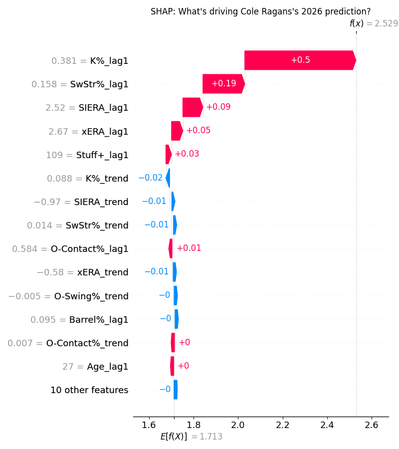
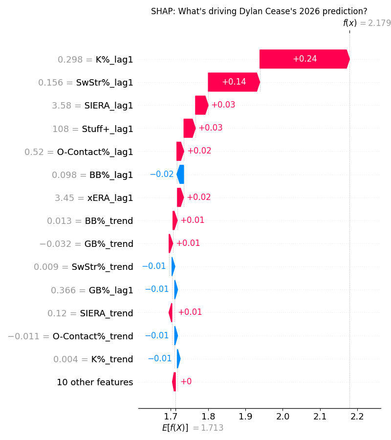
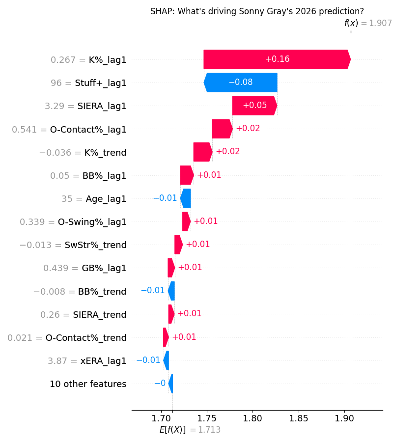
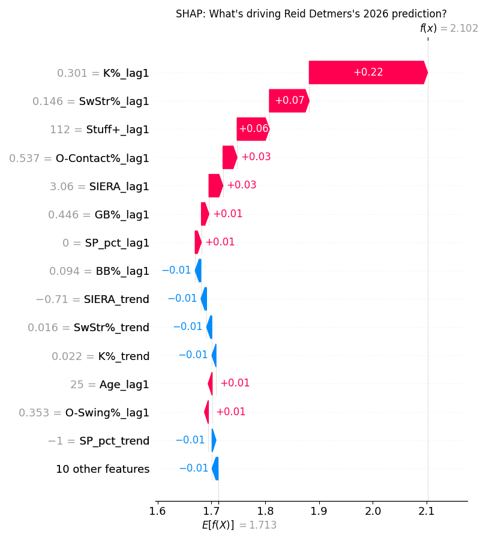
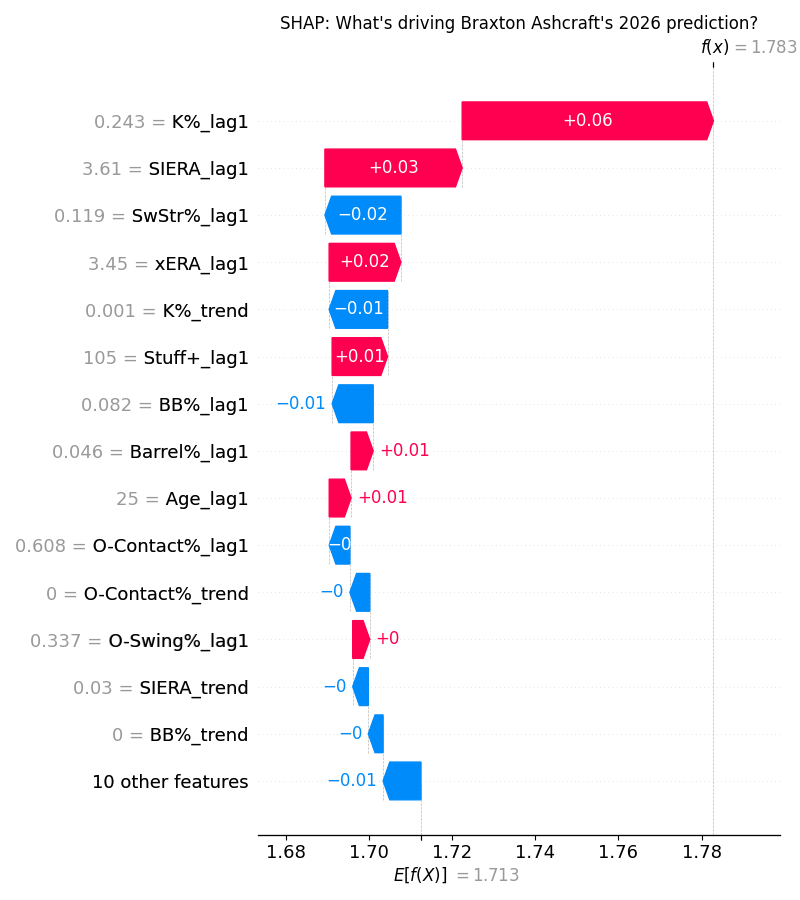

# Starting Pitchers

Time for the most fun position... starting pitchers will win (or lose) your league. 

## Upper Tier: Cole Ragans (KCR) - ESPN Rank 37, ML Rank 6, Fangraphs Rank 36

From the surface it was a rough 2026 for Ragans - a rotator cuff strain limited him to only 61.2 IP in 2025, and he posted a 4.67 ERA in those innings. However, he posted an insane 38.1 K% in those innnings, second in the league to only Mason Miller (min 50 IP). This was reflected in his 2.50 FIP and 2.45 xFIP, metrics that attempt to boil a pitchers results down to Ks, BBs, and HRs, far more predictive than any ERA type statistic. The stuff is there - Ragans' Stuff+ on Fangraphs was 109 in 2025 and 110 in 2024, with all of his pitches grading out as above average besides a hardly used cutter. The changeup is his best secondary pitch, with an abnormally high 11.5 IVB, meaning it drops much less than expected. This makes it very hard for hitters to discriminate from his fastball, even with a 10 mph difference between the pitches. There are some questions about the workload Ragans will recieve after such a shortened 2025, however he did throw 186.1 IP in 2024, and I see the Royals being competitive enough to need him. This is a guy I would be happy to take in the late second/early third round at least. 

## Upper Tier: Dylan Cease (TOR) - ESPN Rank 53, ML Rank 12, Fangraphs Rank 27
Cease follows a similar mold to Ragans - a guy who misses a ton of bats but got hit with some poor batted ball luck last season. Cease posted a 4.55 ERA in 2025, yet his identical 3.56 FIP and xFIP show he was better than it appeared. Cease has always been a very "vertical" pitcher in terms of his arsenal, meaning he does not have any pitches with a ton of horizontal movement such as a sinker or sweeper. 83% of his pitches last year were either his four-seamer or slider, and although both grade out very well in terms of Stuff+, this led to some issues versus left-handed hitters. In his career Cease has posted a 4.18 FIP versus lefties versus a 3.18 FIP versus righties. If Cease could develop an offspeed pitch to mitigate lefties, or even further hone in his knuckle-curve, this could be a great year for him. I'll note he has also been toying with a new sinker this spring, however it has not graded out well, at a 92 TJStuff+ (shoutout TJStats). Cease is also remarkably healthy, pitching at least 165 IP in each of the last 5 seasons, making him a very nice high floor high ceiling pick (knock on wood). 

## Upper Tier: Sonny Gray (BOS) - ESPN Rank 61, ML Rank 56, Fangraphs Rank 62
You could make the same ERA-FIP argument with Gray here, as his 3.39 FIP in 2025 was nearly a run below his ERA of 4.28. That is not the angle im going to take here however. Gray is awesome at spinning the baseball - his sweeper graded out at a 123 Stuff+ from fangraphs last season, the only of his 6 pitches that graded out above average. This can also been seen in the Statcast Run Value of +7 for the pitch. His curveball also provided +5 run value in 2025, further proving the hypothesis about his spin. Being traded to the Red Sox here is very important - they love maximizing usage of non-fastballs, something which could play into Sonny Gray's hand perfectly. Maximizing that sweeper usage could greatly boost his numbers in 2026, and its not like Gray performed poorly at all in 2025. His 79th percentile K% of 26.7 and 93rd percentile BB% of 5% both provide some wiggle room to work with in 2026. Don't be surprised if Sonny Gray posts a sub 3.50 ERA with great peripherals in 2026. 

## Sleeper: Cody Ponce (TOR) - ESPN Rank 233, ML Rank 137, Fangraphs Rank 165
Note that the ML Rank is derived from fangraphs projections here, since Ponce did not pitch in the MLB in 2025. Ponce had a career resurgence in 2025, winning the KBO MVP while posting a 1.89 ERA in 180 IP while striking out a demonic 36.2% of hitters. Will he replicate those numbers in the MLB? Absolutely not. But I think Ponce can be an above average MLB starter this season. The stuff looks good in spring training; his fastball sits around 96 MPH, recieving a 104 TJStuff+ grade. He also throws a kick-change that was essential to his success in Korea, pairing that with a cutter, slider and curveball, all graded around average. Although the Blue Jays rotation currently has 7 or even 8 capable starting pitchers, I feel that Ponce will be relied on quite heavily for volume. Shane Bieber is hurt to begin the season, Jose Berrios is having elbow issues, Trey Yesavage will most definitely have his innings monitored and Max Scherzer is old. ESPN is underranking Ponce due to the unfamiliarity, so take advantage of that. 

No SHAP 

## Sleeper: Reid Detmers (LAA) - ESPN Rank > 300, ML Rank 43, Fangraphs Rank 192
First off - don't take Detmers in the 4th round. His projections are inflated due to having reliever stats from 2025 projected over starters innings in 2026. After flailing as a starter for the first 4 seasons of his career, Detmers thrived as a reliever in 2025 posting a 3.96 ERA and a 3.12 FIP. The stuff ticked up, reaching a 112 Stuff+ overall. This is likely to drop in 2026, as most of the gains came from a 2 mph gain in his fastball, however I am more intriuged by his 112 Location+, a Fangraphs metric designed to evaluate the ability of a pitcher to locate his pitches. The whiffs and Ks have always been there for Detmers, posting an above average K% in 2023 and 2024 as a starter, however he struggled with hard contact. Detmers has added a splitter to his repertoire of a fastball, slider and curve, and hopefully this along with his newfound command can springboard him into a solid 2026 season. Worth a late round flier to see how he starts the season. 

## Sleeper: Braxton Ashcraft (PIT) - ESPN Rank > 300, ML Rank 242, Fangraphs Rank 294
Ashcraft was quietly very good in 69 innings last season, posting a 2.71 ERA and a 2.78 FIP. Unlike most of these other picks, it wasn't because of the strikeouts, although he still posted a 62nd percentile K rate at 24.3%. Ashcraft excelled at limiting hard contact, limiting batters to a measley 4.6% barrel rate along with coaxing ground ball as a 85th percentile rate of 50.8%. His arsenal is headlined by a slider that averages 92.0 mph, serving as his primary offering against righties. However his best pitch has to be his curveball, which generates around 3 more inches of drop than the average curve while also sitting at 84 mph, 4 mph above average. It grades out immaculately in stuff models, with a 135 Stuff+ from fangraphs. An improvement for this season could be to up the sinker usage relative to his four-seamer as the sinker performed much better in terms of run value and stuff grades. Although much of the focus will be on Paul Skenes and Bubba Chandler in this rotation, don't be shocked if Braxton Ashcraft makes some waves in 2026. 

