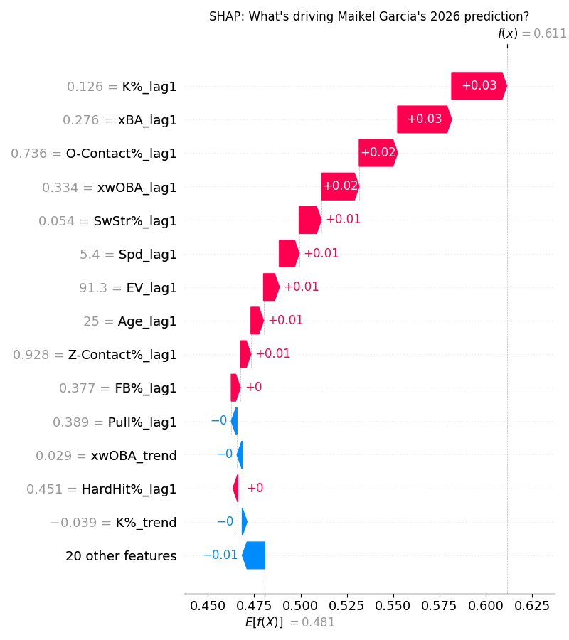
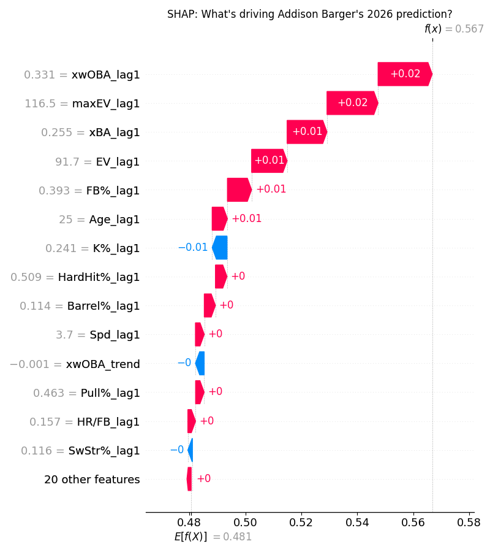
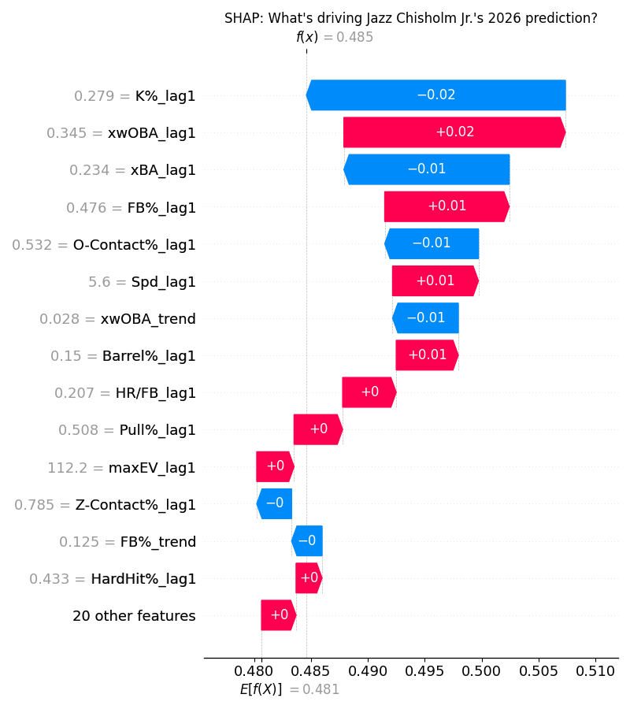

# Third Basemen

## Upper Tier: Maikel Garcia (KCR) - ESPN Rank 100, ML Rank 13, Fangraphs Rank 38

Garcia broke out in 2025 posting a 121 wRC+ and 5.6 WAR, however most projection systems have him regressing to about a league average hitter this season. Yet he still ends up ranked 38th using these pessimistic projections. Did Garcia possibly overperform in 2025? Yes, but that should not overshadow the may improvements he made. Every possible metric improved significantly, with a 2% barrel rate increase to 5.6% and a 2.3% increase in his hard-hit rate. His approach at the plate also changed, becoming much more passive, indicated by a 1st pitch swing % of 23.4%, 7% below league average. This resulted in more walks, and paired with his already known capabilities to not strikeout (93rd percentile K rate in 2025), creates a very valuable player. If Garcia can continue to grow his bat speed and ability to barrel the ball there is no reason he can't keep pace with his numbers from last season. If not - you still get a very strong fantasy player, who also will accumulate a lot of counting stats in this Royals lineup

## Sleeper: Addison Barger (TOR) - ESPN Rank 268, ML Rank 189, Fangraphs Rank 289

Barger had an interesting season in 2025, posting a 125 wRC+ in the first half, but then regressing to an 87 wRC+ in the second half. Then he proceeded to post a 1.025 OPS in the playoffs. Which version will we get this season? I think the good one. Barger crushes baseballs - using his 93rd percentile bat speed to reach a 116.5 max EV (top 3% in the league). He also hits the ball in the air at an above average rate, something a lot of these EV demons fail to do. There are two big questions that may decide Barger's 2026, will he be able to improve his swing decisions & plate discipline, and will he figure out left handed pitching. Barger showed increased aggresiveness in his approach last season, especially early in counts with a 35.5% 1st pitch swing rate, however he still whiffed more than league average. He operated more as a platoon bat in 2025, posting a measley 69 wRC+ against lefties in only 83 at bats. However I noticed improvement qualitatively against lefties throughout last season, and it has carried over into spring training. I would buy that Barger becomes an everyday player this season and hits 25+ HR with a 115 wRC+. 

## Bust: Jazz Chisholm Jr. (NYY) - ESPN Rank 68, ML Rank 138, Fangraphs Rank 98

The easy pick here would be Eugenio Suarez - but Jazz has a more interesting case. In 2025 Chisholm really played into the quintessential Yankee Stadium left handed hitter profile, selling out for pulled flyballs. The results were quite good, posting a career high 31 HR along with a 126 wRC+. In real life this is likely a smart approach, however in fantasy this may hurt his stock, as the strikeouts are a big problem with an 8th percentile K rate of 27.9% in 2025. Jazz also rarely squared the ball up with a 9th percentile squared-up % of 20.4% in 2025, once again illustrating the lean into this all or nothing approach. One important note here is that the average exit velocity was only in the 35th percentile for Jazz, a (negative) separator between him and some of the other similar archetype players in the league. he Yankee effect is here - the stadium is a godsend and hitting in a lineup with Aaron Judge will provide counting stats, however I would avoid putting too much stock into such a boom or bust player in this fantasy format.

